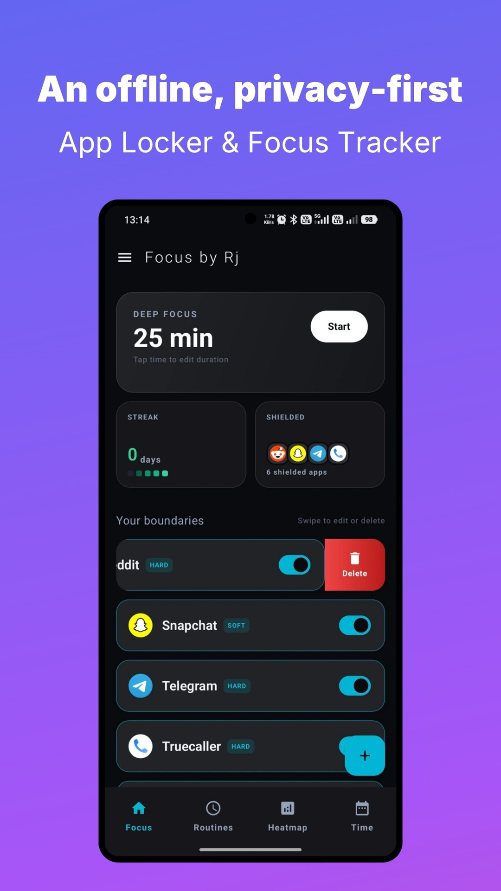
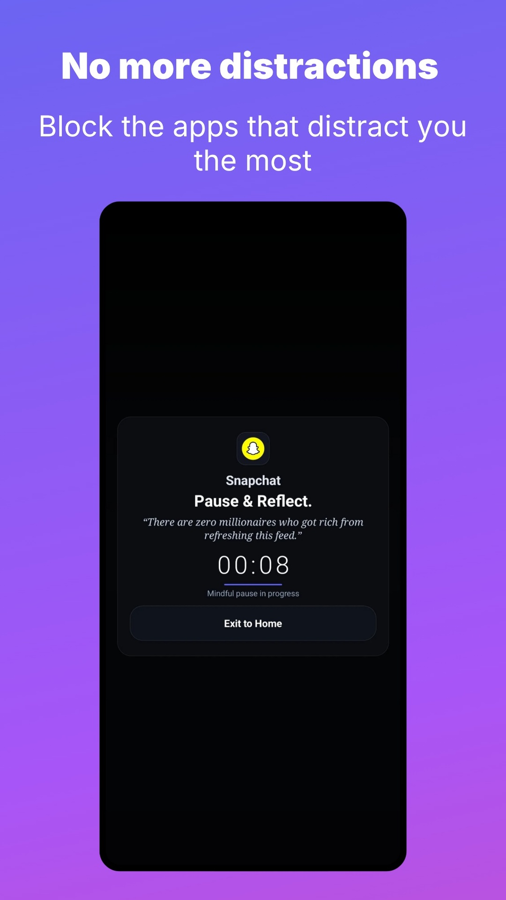
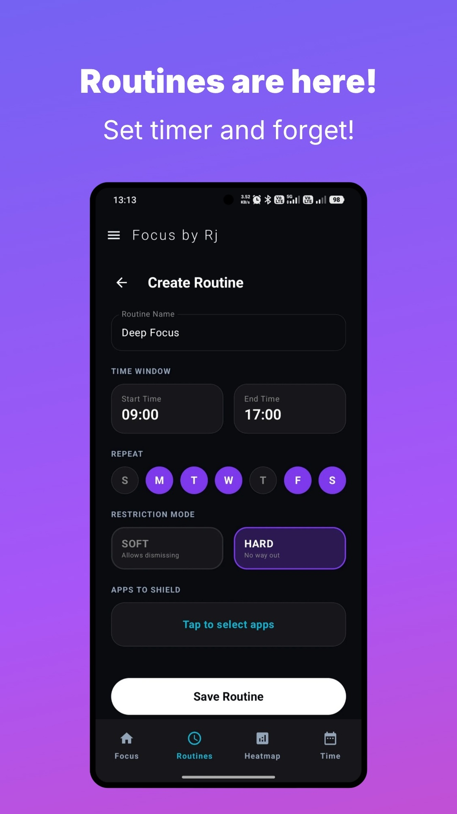
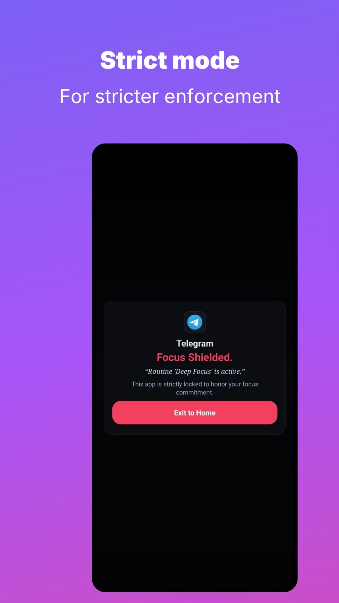
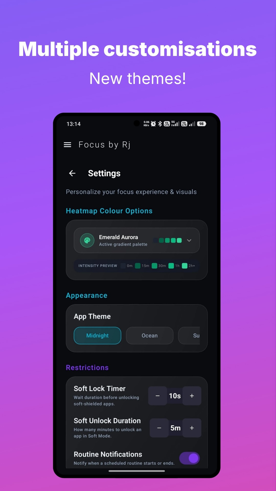
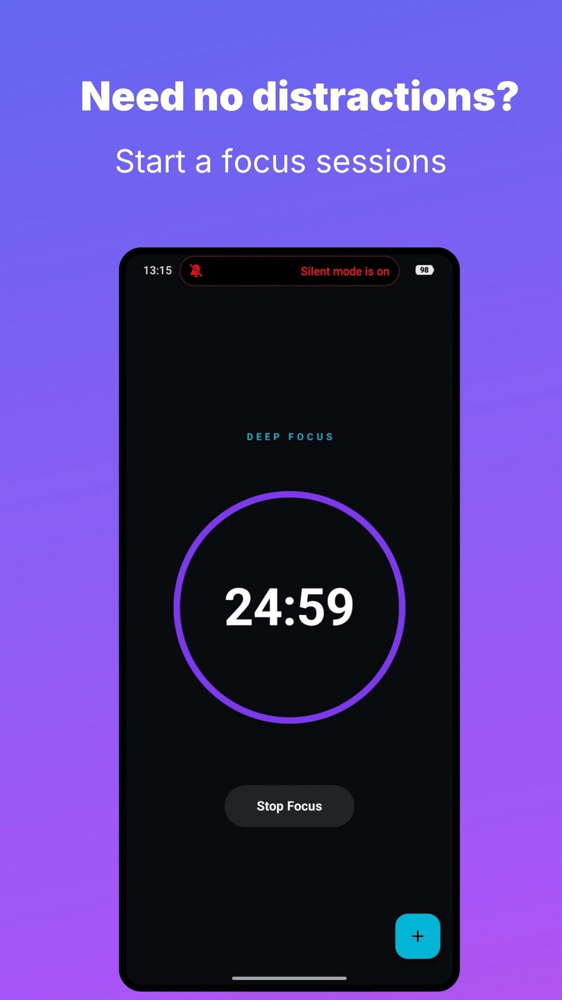
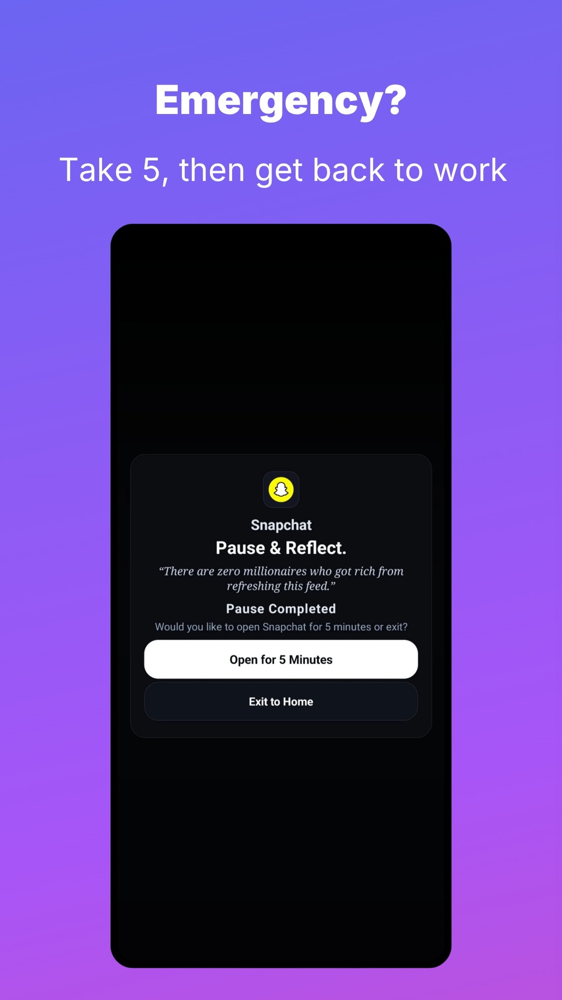
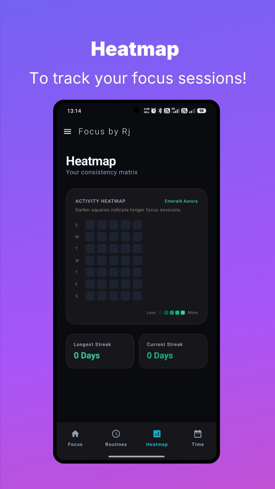

  

  <h1 align="center">Focus by Rj</h1>
  
  

    <strong>Reclaim your attention. Zero trackers. 100% offline.</strong>
  

  

    <a href="#overview">Overview</a> •
    <a href="#features">Features</a> •
    <a href="#screenshots">Screenshots</a> •
    <a href="#privacy-architecture">Privacy</a> •
    <a href="#permissions-breakdown">Permissions</a> •
    <a href="#build--development">Development</a> •
    <a href="#license">License</a>
  

  <!-- Modern Flat Badges -->
  

    
    
    
    
  

---

## 📌 Overview

**Focus by Rj** is an open-source Android app locker and focus manager engineered around a single core principle: **digital wellness should never come at the cost of personal privacy**. 

Unlike standard blockers that monetize screen-time behavior through analytics and cloud syncing, Focus operates in complete isolation on your hardware.

> [!IMPORTANT]
> **No Internet Permission Required.** Focus by Rj does not request network access. Your usage statistics, app configurations, and habits never leave your device.

---

## ✨ Features

<table>
  <tr>
    <td width="50%">
      <h3>🛡️ Smart App Locker</h3>
      Instant, system-level restrictions for distracting applications with dynamic overlay protection.
    </td>
    <td width="50%">
      <h3>⏱️ Deep Work Timers</h3>
      Dedicated focus intervals designed around distraction-free study and sprint sessions.
    </td>
  </tr>
  <tr>
    <td width="50%">
      <h3>🔁 Automated Routines</h3>
      Set recurring trigger profiles like <i>Bedtime</i>, <i>Workday</i>, or <i>Deep Focus</i> effortlessly.
    </td>
    <td width="50%">
      <h3>🔥 Focus Heatmap & App Usage</h3>
      Visual activity heatmap tracking your daily focus sessions alongside per-app screen time breakdowns.
    </td>
  </tr>
  <tr>
    <td colspan="2">
      <h3>🔒 Tamper-Proof Safeguards</h3>
      Device Administrator protection and secure fallback mechanics to prevent bypasses or uninstallation mid-session.
    </td>
  </tr>
</table>

---

## 📱 Screenshots

  
  
  
  

  
  
  
  

---
